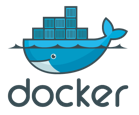

# Multi‑PHP Docker Test Stack

 

Dieses Projekt stellt eine lokale **LAMP‑Testumgebung mit mehreren PHP‑Versionen parallel** bereit.  
Es dient vor allem dazu, bestehende Anwendungen zwischen verschiedenen PHP‑Versionen zu vergleichen und Migrationen (z. B. von PHP 5.6 auf PHP 8.5) zu testen.

Der Stack basiert auf **Docker Compose** und enthält:

- PHP **5.6**
- PHP **7.4**
- PHP **8.5**
- **MariaDB 10.3**
- **phpMyAdmin**
- aktivierte PHP‑Extensions
- **Composer**
- **Xdebug**
- Healthchecks und Container‑Logging

Alle PHP‑Container greifen auf denselben Projektcode zu, sodass Änderungen sofort in allen Versionen getestet werden können.

---

# Voraussetzungen

Installiert sein müssen:

- Docker
- Docker Compose (v2 empfohlen)

Test der Installation:

```
docker --version
docker compose version
```

---

# Projektstruktur

```
project/
 ├─ docker-compose.yml
 ├─ html/                 # Webroot (Projektcode)
 ├─ mysql_data/           # persistente Datenbankdaten
 ├─ logs/
 │   ├─ php56/
 │   ├─ php74/
 │   └─ php85/
 ├─ php-config/
 │   ├─ php.ini
 │   └─ xdebug-php56.ini
 ├─ php56/
 │   └─ Dockerfile
 ├─ php74/
 │   └─ Dockerfile
 └─ php85/
     └─ Dockerfile
```

Der Ordner **html/** ist das DocumentRoot für alle PHP‑Container.

---

# Starten der Umgebung

Container bauen und starten:

```
docker compose up -d --build
```

Container stoppen:

```
docker compose down
```

Logs anzeigen:

```
docker compose logs -f
```

---

# Zugriff auf die Services

Nach dem Start sind folgende URLs verfügbar:

PHP 5.6  
http://localhost:8056

PHP 7.4  
http://localhost:8074

PHP 8.5
http://localhost:8085

phpMyAdmin  
http://localhost:8080

---

# Datenbankzugang

Datenbank: MariaDB 10.3

Standardzugang:

Host  
```
db
```

Root Benutzer  
```
root
```

Root Passwort  
```
root_password
```

Standarddatenbank  
```
lamp_db
```

Optionaler Benutzer

User  
```
lamp_user
```

Passwort  
```
lamp_password
```

---

# Composer verwenden

Composer ist in allen PHP‑Containern installiert.

Beispiel (PHP 8.5):

```
docker compose exec php85 composer install
```

Für alte Projekte mit PHP 5.6:

```
docker compose exec php56 composer install
```

---

# PHP‑Version prüfen

```
docker compose exec php56 php -v
docker compose exec php74 php -v
docker compose exec php85 php -v
```

---

# Aktivierte PHP‑Extensions

Folgende Extensions sind standardmäßig aktiviert:

- mysqli
- pdo
- pdo_mysql
- gd
- intl
- mbstring

Zusätzlich:

- Composer
- Xdebug

---

# Testseite

Lege zum schnellen Test eine Datei an:

html/health.php

```
<?php
echo "OK - PHP ".phpversion();
```

Dann erreichbar unter:

```
http://localhost:8056/health.php
http://localhost:8074/health.php
http://localhost:8083/health.php
```

---

# Logs

Apache‑Logs werden lokal gespeichert unter:

```
logs/php56
logs/php74
logs/php85
```

Container‑Logs anzeigen:

```
docker compose logs -f php85
```

---

# Typischer Workflow für Migrationen

1. Anwendung in **html/** legen
2. Projekt mit **PHP 5.6 testen**
3. Fehler unter **PHP 7.4 beheben**
4. Anwendung unter **PHP 8.5 final prüfen**

So lassen sich Inkompatibilitäten schrittweise identifizieren.

---

# Hinweise

PHP 5.6 ist **End of Life** und sollte nur für Test‑ oder Migrationszwecke genutzt werden.

Für produktive Systeme wird empfohlen:

- PHP ≥ 8.2
- aktuelle Datenbankversion
- regelmäßige Sicherheitsupdates

---

# Projekt starten (Kurzfassung)

```
docker compose up -d --build
```

Browser öffnen:

- http://localhost:8056
- http://localhost:8074
- http://localhost:8083
- http://localhost:8080
